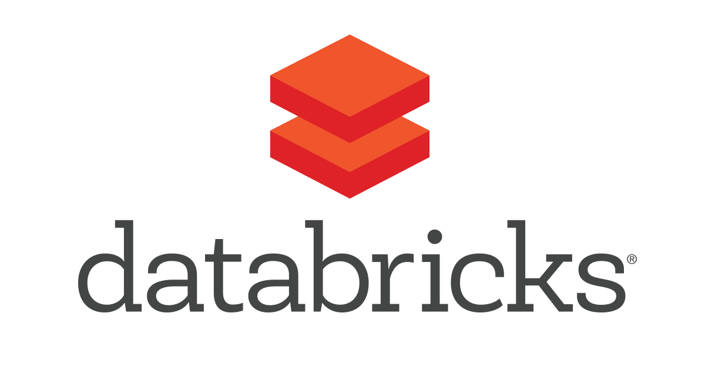

  <h1 align="center"> Hi, I'm Jesús.  👋</h1>
  <h2>About me...</h2>
  I have a Bachelor's Degree in Bionics Engineering from UPIITA-IPN. I'm passionate about learning new things, developing new skills and participating in innovative projects. 

  

    <ul>
      <li>🌱 I’m currently learning Tiny ML and expanding my tech stack.</li >
      <li>👯 I’m looking to collaborate on innovative AI projects.</li>
      <li>📫 How to reach me: 
        
        or
        
      </li>
    </ul>
  

  <h2>My technical skills 💻⚙</h2> 
  
  

    <h3>Programming Languages:</h3>
    

      &nbsp&nbsp
      
      &nbsp
      &nbsp&nbsp&nbsp&nbsp 
      &nbsp&nbsp 
      &nbsp 
      &nbsp 
      
       
       
      &nbsp
      &nbsp&nbsp
      &nbsp&nbsp
       
       
    

  

  
  

    <h3>Software tools:</h3>
    

      &nbsp&nbsp
      &nbsp&nbsp
      &nbsp&nbsp
      
      &nbsp
      
      &nbsp&nbsp
      &nbsp&nbsp
       
       
      
      &nbsp&nbsp
      &nbsp&nbsp
      &nbsp&nbsp
      &nbsp&nbsp
      &nbsp&nbsp
      &nbsp&nbsp
      &nbsp&nbsp
       
       
      &nbsp&nbsp
      &nbsp&nbsp
      &nbsp&nbsp
      
       
       
    

  

  

    <h3>Frameworks & libraries:</h3>
    

      
      &nbsp&nbsp&nbsp
      &nbsp&nbsp
      &nbsp&nbsp
       
       
      &nbsp&nbsp
      &nbsp&nbsp
      &nbsp&nbsp
      
    

  

<h2>GitHub Stats</h2>
  

    
  

